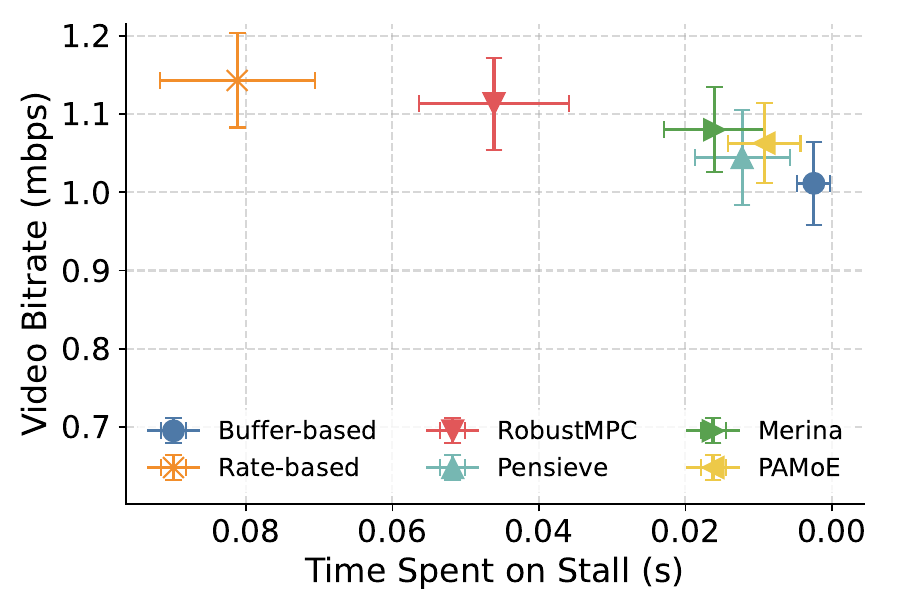
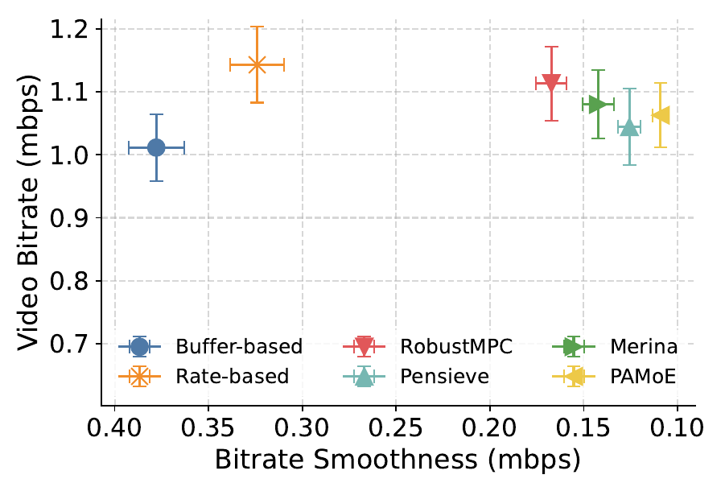
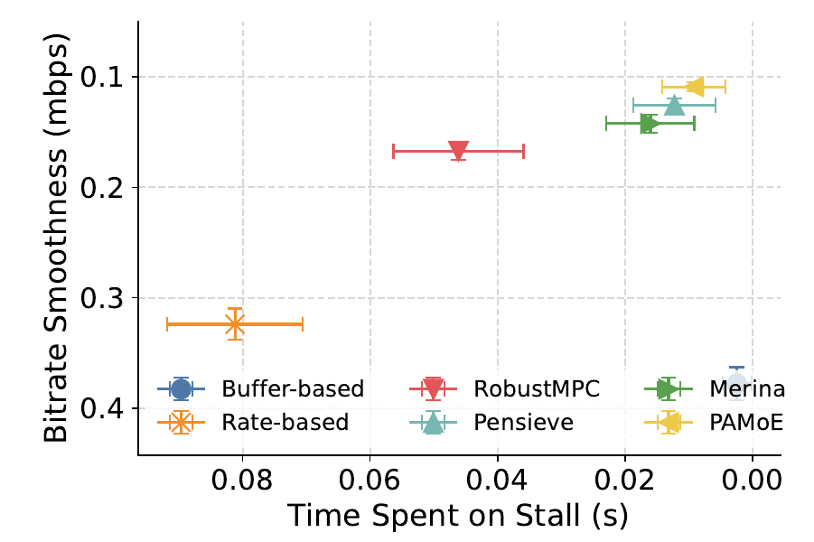

# Plasticity-Aware Mixture of Experts for Learning Under QoE Shifts in Adaptive Video Streaming

[](https://www.python.org/downloads/)
[](https://pytorch.org/)
[](LICENSE)
[](https://arxiv.org/abs/2504.09906)


<p align="center">
  
  
  
  
</p>


A reinforcement learning framework for adaptive video streaming that leverages **Plasticity-Aware Mixture of Experts (PA-MoE)** to handle Quality of Experience (QoE) shifts across different content types (documentary, live, news). This project implements various MoE architectures with PPO (Proximal Policy Optimization) to achieve robust bitrate adaptation under changing QoE preferences.

## 🎯 Features

- **Multiple MoE Architectures**: Supports MLP, MoE, SparseMoE, and Plasticity-Aware MoE (PA-MoE) for both policy and value networks
- **QoE Shift Handling**: Adapts to different content types with varying QoE preferences (bitrate, rebuffering, smoothness)
- **PPO-based Training**: Implements PPO algorithm with GAE (Generalized Advantage Estimation) for stable learning
- **Comprehensive Evaluation**: Includes comparison with baseline methods (BOLA, Buffer-based, Rate-based, RobustMPC, Pensieve, Merina)
- **Rich Visualizations**: Generates performance plots including CDF, QoE components, bitrate-rebuffer trade-offs, and smoothness analysis
- **Plasticity Mechanisms**: Implements expert noise injection and dormant unit detection for better adaptation

## 📋 Table of Contents

- [Installation](#installation)
- [Quick Start](#quick-start)
- [Project Structure](#project-structure)
- [Usage](#usage)
  - [Training](#training)
  - [Evaluation](#evaluation)
- [Configuration](#configuration)
- [Results](#results)
- [Architecture](#architecture)
- [Citation](#citation)
- [License](#license)

## 🚀 Installation

### Prerequisites

- Python 3.9
- CUDA-capable GPU (optional, but recommended)
- Conda (recommended) or pip

### Setup

1. **Clone the repository**
   ```bash
   git clone https://github.com/tinyzqh/PA-MoE
   cd PA-MoE
   ```

2. **Create conda environment**
   ```bash
   conda create -n pamoe python=3.9
   conda activate pamoe
   ```

3. **Install dependencies**
   ```bash
   pip install -r requirements.txt
   ```

4. **Install OptiVerse (for performance evaluation)**
   ```bash
   pip install git+https://github.com/tinyzqh/OptiVerse.git
   ```

## 🏃 Quick Start

### Training

Train a PA-MoE agent with default configuration (distill moe is old name of plasticity aware MoE.):

```bash
export PYTHONPATH=.
python src/ppo.py --envs_model change --seed 1 --policy_type dmoe --value_type dmoe
```

### Evaluation and Visualization

Run evaluation pipeline to compare different methods and generate plots:

```bash
python src/plots_perform/pipeline.py
```

This will generate performance plots in the `assert/` directory:
- `cdf_test.pdf`: Cumulative distribution function of QoE
- `qoe_bar_test.pdf`: QoE component breakdown
- `bitrate_rebuf_test.pdf`: Bitrate vs rebuffering trade-off
- `smo_rebuffer_test.pdf`: Smoothness vs rebuffering trade-off
- `bitrate_smo_test.pdf`: Bitrate vs smoothness trade-off

## 📁 Project Structure

```
PA-MoE/
├── src/
│   ├── ppo.py                 # Main training script
│   ├── configs/
│   │   └── ppo_config.py      # PPO configuration
│   ├── envs/
│   │   ├── StreamingEnv.py    # Adaptive streaming environment
│   │   ├── trace/             # Network trace data
│   │   └── envivio/           # Video chunk size data
│   ├── network/
│   │   ├── mlp/               # MLP baseline
│   │   ├── moe/               # Standard MoE
│   │   ├── sparse_moe/        # Sparse MoE
│   │   └── distill_moe/       # PA-MoE (DistillMoE)
│   ├── plots_perform/
│   │   ├── pipeline.py        # Evaluation pipeline
│   │   ├── agents/            # Agent implementations
│   │   │   ├── pamoe_agent.py
│   │   │   ├── ppo_agent.py
│   │   │   └── ...
│   │   └── weights/           # Pre-trained model weights
│   ├── plots/                 # Analysis plots
│   └── utils/                 # Utility functions
├── assert/                    # Generated plots and results
├── train.sh                   # Training script
├── requirements.txt           # Python dependencies
└── README.md
```

## 📖 Usage

### Training

The training script supports various configurations:

```bash
python src/ppo.py \
    --envs_model change \           # Environment mode: "normal" or "change"
    --seed 1 \                      # Random seed
    --policy_type dmoe \            # Policy network: "mlp", "moe", "smoe", "dmoe"
    --value_type dmoe \             # Value network: "mlp", "moe", "smoe", "dmoe"
    --total_timesteps 2000000 \     # Total training timesteps
    --learning_rate 1e-3 \          # Learning rate
    --track                         # Enable wandb tracking
```

**Key Parameters:**
- `envs_model`: 
  - `"normal"`: Fixed content type (documentary)
  - `"change"`: Varying content types (documentary → live → news → ...)
- `policy_type` / `value_type`: Network architecture
  - `"mlp"`: Multi-layer perceptron baseline
  - `"moe"`: Standard Mixture of Experts
  - `"smoe"`: Sparse MoE
  - `"dmoe"`: PA-MoE (DistillMoE with plasticity mechanisms)

**Training Modes:**
- **Normal mode**: Train on a single content type (documentary)
- **Change mode**: Train with QoE shifts across different content types

### Evaluation

The evaluation pipeline (`src/plots_perform/pipeline.py`) compares multiple methods:

- **Rule-based**: Buffer-based, Rate-based, RobustMPC
- **Learning-based**: Pensieve (PPO), Merina (Meta-RL), PA-MoE

Results are saved as PDF files in the `assert/` directory.

### Configuration

Modify `src/configs/ppo_config.py` to adjust hyperparameters:

```python
@dataclass
class Config:
    # Training
    total_timesteps: int = 2_000_000
    learning_rate: float = 1e-3
    num_steps: int = 2000
    update_epochs: int = 5
    
    # PPO
    clip_coef: float = 0.2
    vf_coef: float = 5
    ent_coef: float = 0.0
    gamma: float = 0.99
    gae_lambda: float = 0.95
    
    # Plasticity
    redo_tau: float = 0.5        # Dormant unit threshold
    gradient_tau: float = 0.05   # Gradient threshold
```

## 📊 Results

### Performance Comparison

PA-MoE demonstrates superior performance in handling QoE shifts:

- **Better QoE**: Achieves higher average QoE across different content types
- **Robust Adaptation**: Maintains performance when QoE preferences change
- **Efficient Expert Utilization**: Activates relevant experts for different content types

### Generated Plots

The evaluation generates comprehensive visualizations:

1. **CDF of QoE**: Distribution of QoE values across sessions
2. **QoE Components**: Breakdown of bitrate, rebuffering, and smoothness rewards
3. **Bitrate-Rebuffer Trade-off**: Performance in bitrate vs rebuffering space
4. **Smoothness-Rebuffer Trade-off**: Performance in smoothness vs rebuffering space
5. **Bitrate-Smoothness Trade-off**: Performance in bitrate vs smoothness space

## 🏗️ Architecture

### PA-MoE (Plasticity-Aware MoE)

PA-MoE extends standard MoE with plasticity mechanisms:

1. **Noisy Top-K Router**: Routes inputs to experts with pseudo-noise for exploration
2. **Expert Noise Injection**: Adds small noise to expert parameters to maintain plasticity
3. **Dormant Unit Detection**: Identifies and reactivates dormant units using ReDo (Recycled Dormant) mechanism
4. **Gradient-based Adaptation**: Monitors gradient information for expert utilization

### Network Components

- **Router**: Noisy Top-K gating network that selects experts
- **Experts**: Specialized networks for different QoE regimes
- **Policy Head**: Outputs action probabilities
- **Value Head**: Estimates state values

## 🔬 Key Innovations

1. **Plasticity Mechanisms**: Expert noise injection and dormant unit reactivation enable adaptation to QoE shifts
2. **Content-Aware Routing**: Router learns to select appropriate experts for different content types
3. **Stable Training**: Pseudo-noise in router maintains PPO ratio stability while enabling exploration

## 📝 Citation

If you use this code in your research, please cite:

```bibtex
@article{he2025plasticity,
  title={Plasticity-Aware Mixture of Experts for Learning Under QoE Shifts in Adaptive Video Streaming},
  author={He, Zhiqiang and Liu, Zhi},
  journal={arXiv preprint arXiv:2504.09906},
  year={2025}
}
```

## 🤝 Contributing

Contributions are welcome! Please feel free to submit a Pull Request.

## 📄 License

This project is licensed under the MIT License - see the LICENSE file for details.

## 🙏 Acknowledgments

- OptiVerse for the video streaming environment
- The open-source RL community for PPO implementations

## 📧 Contact

For questions or issues, please open an issue on GitHub.

---

**Note**: This project is part of research on adaptive video streaming with reinforcement learning. For detailed experimental results and analysis, please refer to the paper (if available).
